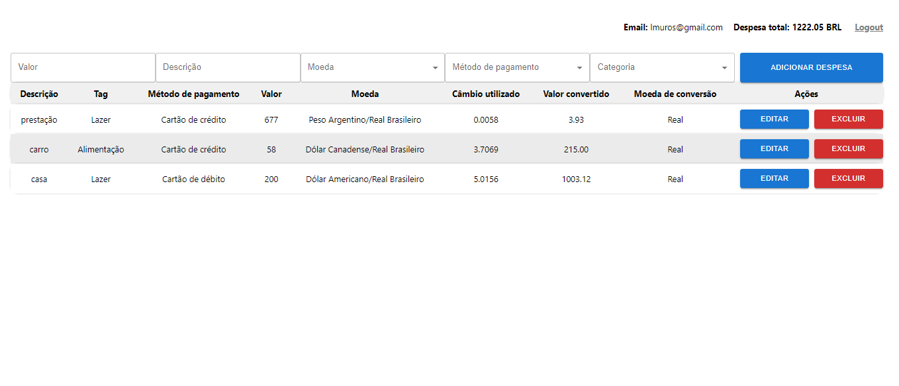

 - Esta é uma aplicação projetada para ajudar no controle financeiro, permitindo o registro e acompanhamento dos gastos;
 - O projeto conta com uma página de login, onde deve ser inserido um formato válido de e-mail e senha contendo pelo menos 6 caracteres com ao menos uma letra maiúscula.
 - A página interna mostra a relação de gastos inseridos pelo formulário superior;
 - O principal objetivo desta aplicação é guardar uma referência sobre como aplicar Redux e Typescript em qualquer outro projeto. É possível adicionar dados no estado global, modificar ou excluir esses dados.  
 - Uma api pública (https://economia.awesomeapi.com.br/json/all) é utilizada para consulta e cálculo de valores de câmbio para conversão de moeda;
 - Os campos da página de login possuem validação para que recebam o formato correto de dado conforme o tipo de input, sendo um para e-mail e outro para a senha. Caso o formato seja inválido, o redirect não ocorre para a aplicação; Não há de fato um sistema de login, o objetivo é apenas manter uma referência para validação de campos;

## Available Scripts

In the project directory, you can run:

### `npm start`

Runs the app in the development mode.\
Open [http://localhost:3000](http://localhost:3000) to view it in the browser.

The page will reload if you make edits.\
You will also see any lint errors in the console.

### `npm test`

Launches the test runner in the interactive watch mode.\
See the section about [running tests](https://facebook.github.io/create-react-app/docs/running-tests) for more information.

### `npm run build`

Builds the app for production to the `build` folder.\
It correctly bundles React in production mode and optimizes the build for the best performance.

The build is minified and the filenames include the hashes.\
Your app is ready to be deployed!

See the section about [deployment](https://facebook.github.io/create-react-app/docs/deployment) for more information.

### `npm run eject`

**Note: this is a one-way operation. Once you `eject`, you can’t go back!**

If you aren’t satisfied with the build tool and configuration choices, you can `eject` at any time. This command will remove the single build dependency from your project.

Instead, it will copy all the configuration files and the transitive dependencies (webpack, Babel, ESLint, etc) right into your project so you have full control over them. All of the commands except `eject` will still work, but they will point to the copied scripts so you can tweak them. At this point you’re on your own.

You don’t have to ever use `eject`. The curated feature set is suitable for small and middle deployments, and you shouldn’t feel obligated to use this feature. However we understand that this tool wouldn’t be useful if you couldn’t customize it when you are ready for it.

## Learn More

You can learn more in the [Create React App documentation](https://facebook.github.io/create-react-app/docs/getting-started).

To learn React, check out the [React documentation](https://reactjs.org/).
